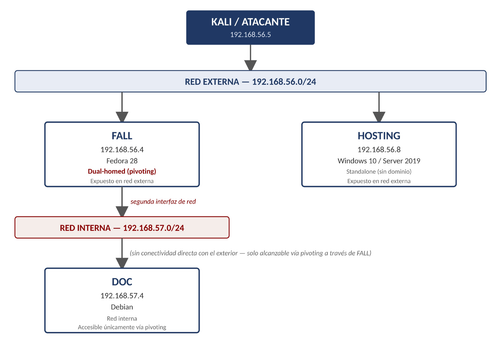

# Cybersecurity Assessment Report Lab

Proyecto práctico de auditoría de seguridad y pentesting sobre una infraestructura empresarial simulada (Good Tech Inc), desarrollada en un laboratorio propio.

El ejercicio reproduce un test de intrusión de caja negra: se parte de una posición externa sin credenciales previas y, a través de una cadena de vulnerabilidades encadenadas, se alcanza el compromiso completo de la infraestructura, incluyendo pivoting hacia un segmento de red interno.

El proyecto no se limita a explotar máquinas vulnerables, ya que su finalidad la elaboración de un **informe profesional de auditoría de seguridad** con el siguiente contenido:

1. Resumen Ejecutivo
2. Metodología de Valoración de Riesgo
3. Alcance y Metodología
    1. Objetivos
    2. Alcance
    3. Metodología
    4. Arquitectura de Red
4. Resumen de Hallazgos
5. Cadena de Ataque (Attack Path)
    1. 5.1 Ruta FALL → DOC
    2. 5.2 Ruta HOSTING
6. Hallazgos Detallados
    1. 6.1 Hallazgos en FALL (192.168.56.4)
    2. 6.2 Hallazgos en DOC (192.168.57.4 — red interna)
    3. 6.3 Hallazgos en HOSTING (192.168.56.8)
7. Recomendaciones Priorizadas
8. Conclusión
9. Herramientas Utilizadas

> **Reconocimiento → Enumeración → Explotación → Post-explotación → Pivoting  → Reporting**

---

## Arquitectura del laboratorio

La infraestructura está formada por tres sistemas, distribuidos en dos segmentos de red. FALL tiene conectividad con ambos segmentos y actúa como punto de pivoting hacia la red interna, donde reside DOC.

| Sistema     | Origen   | Rol                                                             |
| ----------- | -------- | --------------------------------------------------------------- |
| **FALL**    | VulnHub  | Expuesto en red externa. punto de pivoting hacia la red interna |
| **HOSTING** | HackMyVM | Expuesto en red externa                                         |
| **DOC**     | HackMyVM | Red interna; accesible únicamente vía pivoting desde FALL       |

---

## El informe de auditoría

La pieza central de este proyecto es un **informe de auditoría de seguridad** que traduce el trabajo técnico en un documento orientado a riesgo, impacto y remediación — el mismo tipo de entregable que se produce en una auditoría profesional real.

El informe está estructurado en:

1. **Resumen Ejecutivo**: comunica de forma rápida el nivel de exposición, los principales riesgos y el impacto de los hallazgos desde una perspectiva orientada a negocio.
2. **Metodología de Valoración de Riesgo**: describe el uso de CVSS v3.1 como estándar de clasificación de severidad.
3. **Alcance y Metodología**: documenta qué sistemas forman parte de la evaluación, la arquitectura de red y el enfoque seguido durante el pentest (objetivos, alcance, metodología, arquitectura de red).
4. **Resumen de Hallazgos**: vista global de las vulnerabilidades identificadas y su nivel de riesgo.
5. **Cadena de Ataque (Attack Path)**: representa cómo distintas vulnerabilidades se encadenan para avanzar desde el acceso inicial hasta el compromiso de otros sistemas, incluyendo el pivoting hacia la red interna. Es una de las secciones más relevantes del informe.
6. **Hallazgos Detallados** (FALL, DOC, HOSTING): cada hallazgo incluye descripción técnica, evidencia, impacto, valoración CVSS y recomendación de remediación.
7. **Recomendaciones Priorizadas**: no se limita a listar vulnerabilidades, sino que propone medidas concretas y priorizadas para reducir el riesgo.
8. **Conclusión**
9. **Herramientas Utilizadas**: relación de las herramientas empleadas durante la evaluación.

El informe recoge **17 hallazgos**, clasificados mediante **CVSS v3.1** entre Informativo, Medio, Alto y Crítico.

---

## Write-ups técnicos

Junto al informe, el repositorio incluye **write-ups técnicos** de cada sistema evaluado. Mientras que el informe está orientado a comunicar riesgo, impacto y remediación, los write-ups documentan con mayor profundidad el proceso técnico real seguido durante la evaluación: reconocimiento, enumeración, identificación de vulnerabilidades, explotación, obtención y reutilización de credenciales, escalada de privilegios, pivoting y post-explotación, con sus evidencias y el razonamiento técnico detrás de cada decisión.

---

## Navegación del proyecto

| Recurso | Enlace |
|---|---|
| 📄 **Informe de auditoría** (PDF) | [Informe_Auditoria_GoodTech.pdf](Informe_Auditoria_GoodTech.pdf) |
| 🖼️ **Imágenes y evidencias** | [WriteUp/images/](WriteUp/images/) |

> Los write-ups están organizados por segmento de red, reflejando la propia segmentación de la infraestructura evaluada: la carpeta de la red externa documenta el reconocimiento inicial y el compromiso de FALL y HOSTING, mientras que la carpeta de la red interna recoge el descubrimiento y la explotación de DOC una vez alcanzado mediante pivoting.

### 🌐 Write-ups — Red externa (192.168.56.0/24)

| # | Write-up | Contenido |
|---|---|---|
| 1 | [🔎 Host Discovery](WriteUp/192.168.56.0%2024/1%20-%20Host%20Discovery.md) | Descubrimiento de hosts activos en la red externa |
| 2 | [🖥️ HOSTING](WriteUp/192.168.56.0%2024/2%20-%20192.168.56.8%20-%20HOSTING.md) | Reconocimiento, explotación y escalada de privilegios (192.168.56.8) |
| 3 | [🔀 FALL — Pivoting](WriteUp/192.168.56.0%2024/3%20-%20192.168.56.4%20-%20FALL%20-%20Pivoting.md) | Compromiso de FALL y establecimiento del pivoting hacia la red interna (192.168.56.4) |

### 🔒 Write-ups — Red interna (192.168.57.0/24)

| # | Write-up | Contenido |
|---|---|---|
| 1 | [🔎 Host Discovery](WriteUp/192.168.57.0%2024/1%20-%20Host%20Discovery.md) | Descubrimiento de hosts en la red interna, alcanzada vía pivoting |
| 2 | [🖥️ DOC](WriteUp/192.168.57.0%2024/2%20-%20192.168.57.4%20-%20DOC.md) | Reconocimiento, explotación y escalada de privilegios (192.168.57.4) |

Los write-ups están organizados por segmento de red, reflejando la propia segmentación de la infraestructura evaluada: la carpeta de la red externa documenta el reconocimiento inicial y el compromiso de FALL y HOSTING, mientras que la carpeta de la red interna recoge el descubrimiento y la explotación de DOC una vez alcanzado mediante pivoting.

---

## Qué demuestra este proyecto

Más allá de la explotación técnica, este proyecto recorre el ciclo completo de una evaluación de seguridad: metodología de pentesting, análisis de cadenas de ataque, comprensión de redes y pivoting, escalada de privilegios en distintos sistemas operativos, valoración de riesgo mediante CVSS y documentación rigurosa de evidencias. Y, sobre todo, la capacidad de convertir ese trabajo técnico en un informe profesional capaz de comunicar riesgo e impacto tanto a un perfil técnico como a uno ejecutivo.

---

## Disclaimer

Este proyecto se ha desarrollado exclusivamente en un entorno de laboratorio controlado, utilizando máquinas deliberadamente vulnerables (VulnHub / HackMyVM). La infraestructura, los sistemas y los datos son simulados. El proyecto tiene fines educativos y de portfolio; en ningún momento se han evaluado sistemas ni infraestructuras reales.
